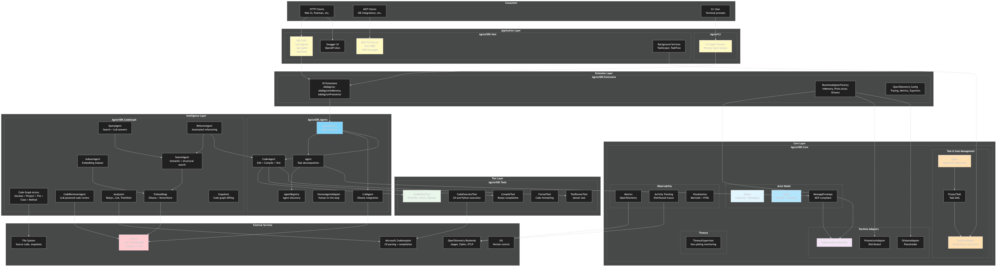

# Agctor — System Architecture Overview



[Edit source](./architecture-diagram.mmd)

## What is Agctor?

Agctor is a .NET actor model framework for building **agentic systems**. It combines the actor model with LLM-powered agents, tool execution, and code analysis to create intelligent, distributed systems that can reason about, modify, and test code autonomously.

## Architecture Layers

### 1. Consumer Layer

Users interact with Agctor through three channels:

- **HTTP REST API** — Full RESTful API for agents, goals, tools with Swagger/OpenAPI UI
- **MCP TCP Server** — Model Context Protocol server (port 8080) for IDE integrations
- **CLI** — Command-line interface for single-prompt processing

### 2. Application Layer

#### AgctorSDK.Host (Web API + MCP Server)
The main application host exposing:
- `POST /api/agents` — Create agents, send messages, query status
- `POST /api/goals` — Define high-level goals that decompose into tasks
- `POST /api/tools/{id}/invoke` — Invoke tools directly
- `POST /api/test/setup-scenario` — Set up predefined test scenarios
- Background services: **TaskScoperHostedService** (goal → task DAG decomposition every 30s) and **TaskFlowHostedService** (task execution every 10s)

#### AgctorCLI (Command-Line Interface)
Simple CLI that accepts a prompt, creates a root agent, processes it through the actor system, and prints the result.

### 3. Extension Layer

#### AgctorSDK.Extensions
Provides dependency injection extension methods (`AddAgctor`, `AddAgctorInMemory`, `AddAgctorProtoActor`, `AddAgctorOrleans`) that wire up the entire framework. Includes:
- **ActorRuntimeAdapterFactory** — Creates runtime adapters by name
- **OpenTelemetry configuration** — Tracing with Jaeger, Zipkin, OTLP, Console exporters
- Feature-specific registration: CodeGraph generation, PR automation

### 4. Intelligence Layer

#### AgctorSDK.Agents (Agent Framework)
The core agent framework implementing the actor model for intelligent agents:
- **Agent** — Base class with recursive task decomposition (max depth 3, max 5 children)
- **LLMAgent** — Communicates with Ollama for natural language processing
- **CoderAgent** — Orchestrates Edit → Compile → Test workflows
- **HumanAgentAdapter** — Facilitates human-in-the-loop interactions
- **AgentFactory** — Creates agents via runtime adapters with unique IDs
- **AgentRegistry** — Tracks all agent instances for discovery

#### AgctorSDK.CodeGraph (Code Intelligence)
Models an entire codebase as an actor hierarchy and provides intelligent agents:
- **Code Graph Actors** — Solution → Project → File → Class → Method (composite pattern)
- **IndexerAgent** — Walks the graph, generates embeddings, stores in vector store
- **SearchAgent** — Semantic (vector) and structural (intent-based) search
- **QueryAgent** — Combines search results with LLM reasoning for natural-language answers
- **RefactorAgent** — Gathers context → LLM plan → CoderAgent execution
- **CodeReviewerAgent** — Reviews commit diffs using LLM
- **Analyzers** — Roslyn (C#), LLM fallback, TreeSitter (Python stub)
- **Embeddings** — Ollama embedding generation + in-memory cosine similarity vector store
- **Snapshots** — Save/load/diff code graph states for change detection

### 5. Tool Layer

#### AgctorSDK.Tools
Tool actors that perform concrete operations:
- **CodeEditorTool** — WriteFile, InsertIntoFile, ReplaceInFile, ApplyPatch (AST-aware via Roslyn)
- **CodeExecutorTool** — Run C# (Roslyn) and Python (IronPython) code
- **CompileTool** — In-memory C# compilation with Roslyn
- **FormatTool** — C# (Roslyn Workspaces) and Python (black) formatting
- **TestRunnerTool** — Execute tests via `dotnet test` CLI

### 6. Core Layer

#### AgctorSDK.Core (Foundation)
The foundation library with zero project dependencies, defining all core abstractions:

**Actor Model:**
- `IActor` — Lifecycle (Initialize, Receive, Shutdown) + state management
- `IAgent` — Extends IActor with prompt processing, subtask assignment, parent-child hierarchy
- `MessageEnvelope` — MCP-compliant message wrapper (payload, metadata, headers)

**Runtime Adapters:**
- `InMemoryActorRuntime` — In-process, fully implemented
- `ProtoActorAdapter` — Distributed via Proto.Actor (gRPC), production-ready
- `OrleansAdapter` — Microsoft Orleans (placeholder)

**Task & Goal Management:**
- `Goal` → `ProjectTask` decomposition
- `TaskFlowEngine` — Executes task DAGs respecting dependencies with configurable concurrency

**Observability:**
- `IMetricsCollector` — Counter, gauge, histogram via OpenTelemetry
- `IActivityTracker` — Distributed tracing with context propagation
- `IVisualizationService` — Mermaid diagrams + HTML for agent hierarchies and message flows

**Timeout Management:**
- `TimeoutSupervisorActor` — Non-polling, message-based timeout monitoring with policy support

## External Dependencies

| Service | Purpose | Used By |
|---------|---------|---------|
| **Ollama** (localhost:11434) | LLM completions + vector embeddings | LLMAgent, CodeGraph agents, LLM analyzers |
| **Roslyn** (Microsoft.CodeAnalysis) | C# parsing, compilation, formatting | Analyzers, Tools, Code generation |
| **OpenTelemetry** | Distributed tracing and metrics | All layers via Core |
| **IronPython** | Python code execution | CodeExecutorTool |
| **Git** | Version control operations | GitCliService, GitEventStore |
| **File System** | Source code, snapshots, actor state | CodeGraph, Persistence, Tools |

## Project Dependency Graph

```
AgctorSDK.Core  ← Foundation (no dependencies)
    │
    ├── AgctorSDK.Agents  ← Agent framework + runtime adapters
    │       │
    │       ├── AgctorSDK.Tools  ← Tool actors
    │       │
    │       └── AgctorSDK.CodeGraph  ← Code intelligence
    │
    └── AgctorSDK.Extensions  ← DI wiring (Core + Agents + Tools)
            │
            ├── AgctorSDK.Host  ← Web API + MCP (all projects)
            │
            └── AgctorCLI  ← CLI (Core + Agents + Tools + Extensions)
```

## Key Design Patterns

| Pattern | Where | Purpose |
|---------|-------|---------|
| **Actor Model** | Core, Agents | Message-based concurrency, isolation, hierarchy |
| **Factory** | AgentFactory, RuntimeAdapterFactory, Language*Factory | Instance creation and lifecycle |
| **Registry** | AgentRegistry, AnalyzerRegistry, SnippetProviderRegistry | Service discovery and tracking |
| **Composite** | CodeGraph actor hierarchy | Tree structure mirroring codebase |
| **Strategy** | ICodeAnalyzer, IIntentResolver, ISnippetProvider | Pluggable implementations |
| **Decorator** | TracedAgent, TracedToolActor, MetricsEnabledActor | Cross-cutting concerns |
| **Adapter** | InMemoryRuntime, ProtoActorAdapter, OrleansAdapter | Runtime abstraction |
| **Template Method** | Agent.ProcessPromptInternalAsync | Override-able processing steps |

## Message Flow

1. **External request** arrives via HTTP API, MCP, or CLI
2. **MessageDispatcher** wraps it in a `MessageEnvelope` (MCP-compliant)
3. **AgentFactory** spawns the appropriate agent via the **RuntimeAdapter**
4. **Agent** processes the prompt — may decompose into subtasks and spawn child agents
5. **Child agents** (LLM, Coder, Search, etc.) execute their specialized logic
6. **Tools** perform concrete operations (file edits, compilation, test execution)
7. **Results** flow back up the agent hierarchy via completion messages
8. **Response** returned to the caller through the original channel

## Per-Project Documentation

Each project maintains its own `docs/` folder with:
- `architecture-diagram.mmd/.jpg/.md`
- `class-diagram.mmd/.jpg/.md`
- `endpoints-diagram.mmd/.jpg/.md`
- `dependencies-diagram.mmd/.jpg/.md`

See individual project docs for detailed diagrams.
