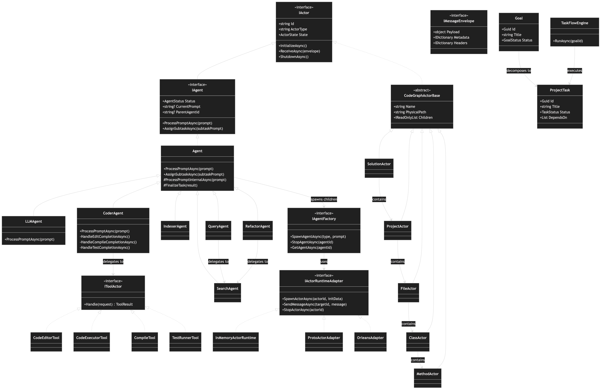

# System-Wide Class Diagram



[Edit source](./class-diagram.mmd)

## Overview

This diagram shows the key classes across all Agctor projects and how they relate to each other at a system level.

## Core Hierarchy

```
IActor (Core)
├── IAgent (Core)
│   └── Agent (Agents)
│       ├── LLMAgent, CoderAgent (Agents)
│       ├── IndexerAgent, SearchAgent, QueryAgent, RefactorAgent (CodeGraph)
│       └── TestScaffolderActor, SnippetResolverAgent (CodeGraph)
│
├── CodeGraphActorBase (CodeGraph)
│   └── SolutionActor → ProjectActor → FileActor → ClassActor → MethodActor
│
└── TimeoutSupervisorActor (Core)
```

## Runtime Adapters
`IActorRuntimeAdapter` → InMemoryActorRuntime, ProtoActorAdapter, OrleansAdapter

## Tools
`IToolActor` → CodeEditorTool, CodeExecutorTool, CompileTool, FormatTool, TestRunnerTool

## Task Management
Goal → ProjectTask → TaskFlowEngine (DAG execution)
