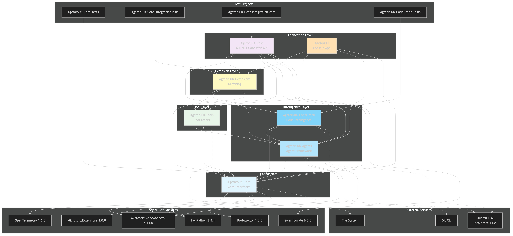

# Solution Dependencies Overview

[Edit source](./dependencies-diagram.mmd)

## Overview

Complete dependency graph for all 11 projects in the Agctor solution.

## Project Dependencies

| Project | Depends On |
|---------|-----------|
| **AgctorSDK.Core** | _(none — foundation)_ |
| **AgctorSDK.Agents** | Core |
| **AgctorSDK.Tools** | Core |
| **AgctorSDK.CodeGraph** | Core, Agents |
| **AgctorSDK.Extensions** | Core, Agents, Tools |
| **AgctorSDK.Host** | Core, Agents, Tools, Extensions, CodeGraph |
| **AgctorCLI** | Core, Agents, Tools, Extensions |

## Test Projects

| Test Project | Tests |
|-------------|-------|
| AgctorSDK.Core.Tests | Core unit tests |
| AgctorSDK.Core.IntegrationTests | Core + Agents + Tools integration |
| AgctorSDK.Host.IntegrationTests | Full Host API integration |
| AgctorSDK.CodeGraph.Tests | CodeGraph unit tests |

## Key NuGet Packages

| Package | Version | Used By |
|---------|---------|---------|
| OpenTelemetry | 1.6.0 | Core |
| Microsoft.CodeAnalysis.CSharp | 4.14.0 | Core, CodeGraph, Tools |
| Proto.Actor | 1.5.0 | Agents |
| Microsoft.Extensions.* | 8.0.0 | Core, Host, CLI |
| Swashbuckle.AspNetCore | 6.5.0 | Host |
| IronPython | 3.4.1 | Core |

## External Services

- **Ollama** (localhost:11434): LLM completions and embeddings
- **Git CLI**: Version control operations
- **File System**: Source code, snapshots, actor persistence
