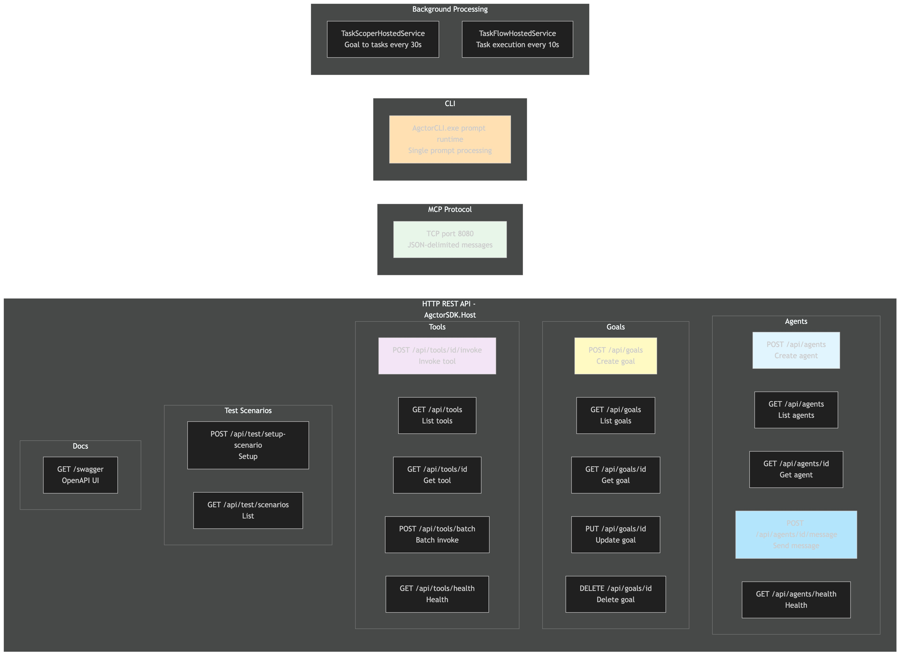

# System Endpoints Overview

[Edit source](./endpoints-diagram.mmd)

## Overview

All external-facing interfaces of the Agctor system.

## HTTP REST API (AgctorSDK.Host)

### Agents (`/api/agents`)
| Method | Path | Description |
|--------|------|-------------|
| POST | `/api/agents` | Create new agent |
| GET | `/api/agents` | List all agents |
| GET | `/api/agents/{id}` | Get agent info |
| POST | `/api/agents/{id}/message` | Send message to agent |
| GET | `/api/agents/health` | Health check |

### Goals (`/api/goals`)
| Method | Path | Description |
|--------|------|-------------|
| POST | `/api/goals` | Create goal |
| GET | `/api/goals` | List goals |
| GET | `/api/goals/{id}` | Get goal |
| PUT | `/api/goals/{id}` | Update goal |
| DELETE | `/api/goals/{id}` | Delete goal |

### Tools (`/api/tools`)
| Method | Path | Description |
|--------|------|-------------|
| POST | `/api/tools/{id}/invoke` | Invoke tool |
| GET | `/api/tools` | List tools |
| GET | `/api/tools/{id}` | Get tool info |
| POST | `/api/tools/batch` | Batch invoke |
| GET | `/api/tools/health` | Health check |

### Test Scenarios (`/api/test`)
| Method | Path | Description |
|--------|------|-------------|
| POST | `/api/test/setup-scenario` | Setup scenario |
| GET | `/api/test/scenarios` | List scenarios |

## MCP Protocol
- TCP port 8080, newline-delimited JSON messages

## CLI
- `AgctorCLI.exe "prompt" [runtime]`

## Background Services
- TaskScoperHostedService (goal → tasks, every 30s)
- TaskFlowHostedService (task execution, every 10s)
