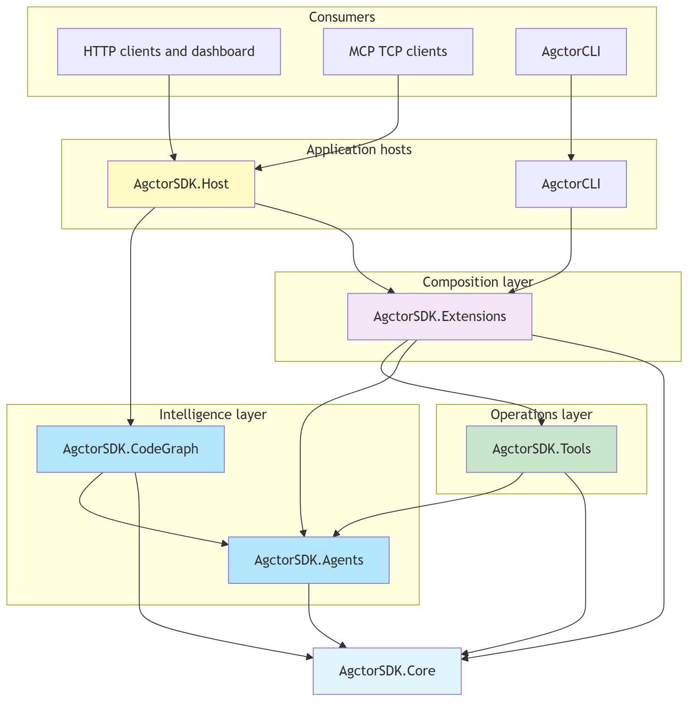

# System Overview — Assembly Interaction

High-level view of how Agctor assemblies connect. For layer-by-layer detail, see [architecture-diagram.md](./architecture-diagram.md).

[Edit source](./system-overview-diagram.mmd)

## Assembly roles

| Assembly | Role |
|----------|------|
| **AgctorSDK.Core** | Shared contracts: actors, messages, goals, project memory, observability |
| **AgctorSDK.Agents** | Agent implementations and runtime adapters (InMemory, Proto.Actor, Orleans) |
| **AgctorSDK.Tools** | Tool actors for edit, compile, test, format, and execute |
| **AgctorSDK.CodeGraph** | Codebase graph, search, indexing, and refactoring agents |
| **AgctorSDK.Extensions** | DI wiring that composes Core, Agents, and Tools for hosts |
| **AgctorSDK.Host** | HTTP API, MCP TCP, dashboard, and host-specific services |
| **AgctorCLI** | Single-prompt command-line entry point |

## Dependency direction

Hosts (**Host**, **CLI**) depend on **Extensions**, which registers **Core**, **Agents**, **Tools**, and (for CLI) **CodeGraph**. **CodeGraph** sits on **Agents** + **Core** and is referenced directly by **Host**. **Tools** depends only on **Core** (`BaseActor`, `ToolActorBase`, project-memory appliers).
